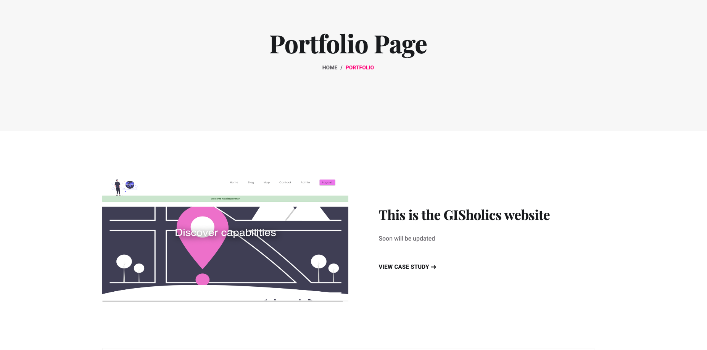
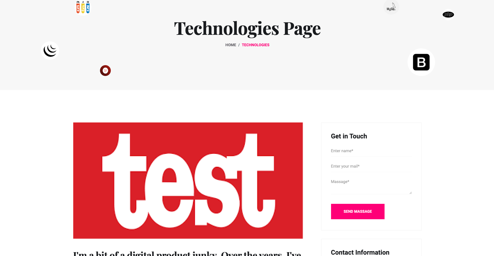
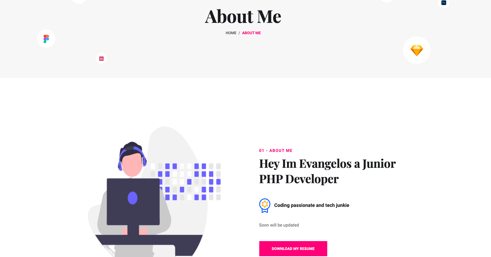
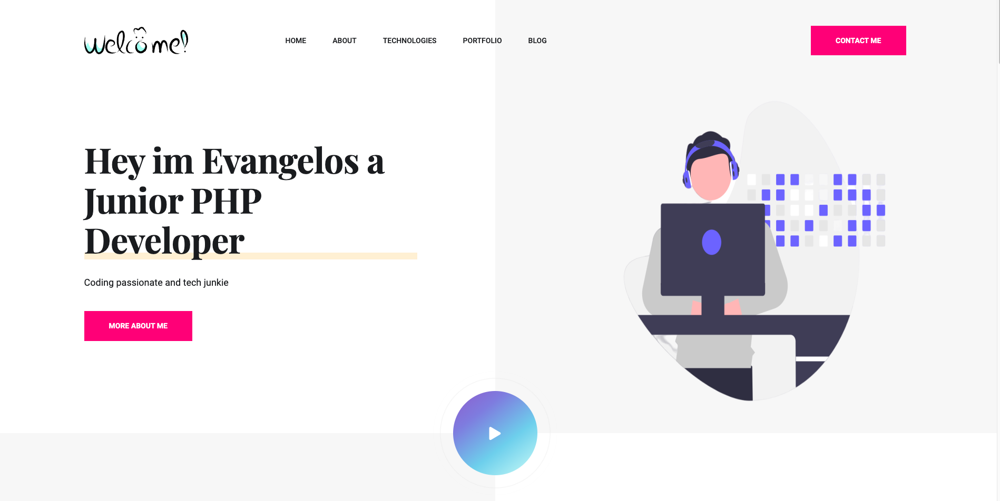

## About Yasou Project

Creating a personal portfolio based on the Laravel framework. The philosophy behind this project is to 

The website uses mainly Laravel 10x including Html and CSS and JavaScript, jQuery for the most frontend functionality and MySQL database

Main area

About area

About me

Portfolio details 

More images will be added soon with explanation, now I'm working on Blog, Categories, Contact me, Footer.

